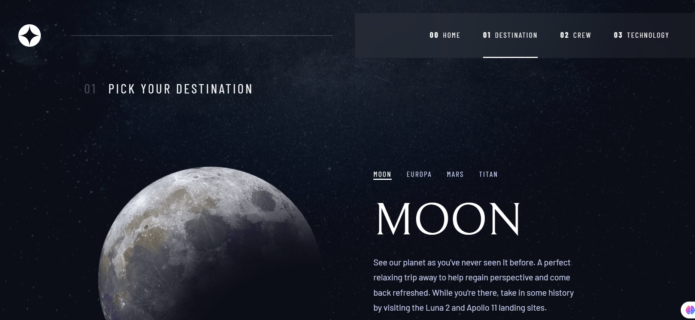
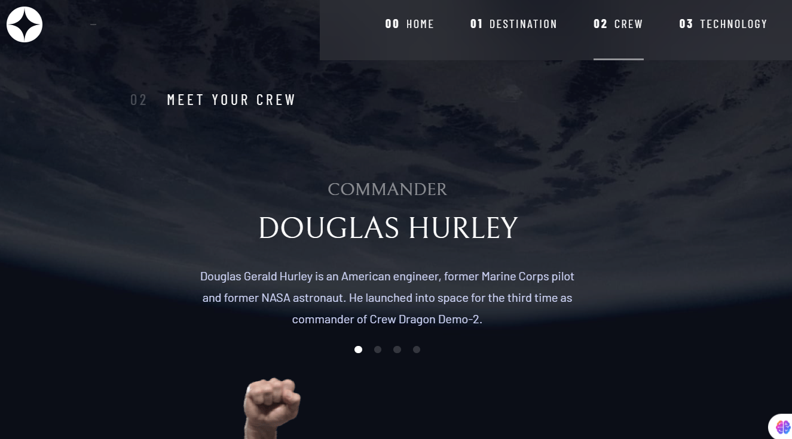
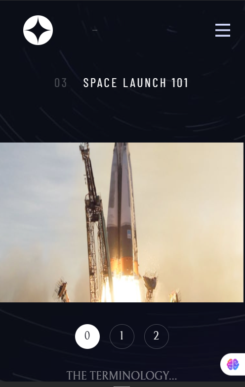

# Frontend Mentor - Space tourism website solution

This is a solution to the [Space tourism website challenge on Frontend Mentor](https://www.frontendmentor.io/challenges/space-tourism-multipage-website-gRWj1URZ3). Frontend Mentor challenges help you improve your coding skills by building realistic projects. 

## Table of contents

- [Overview](#overview)
  - [Screenshot](#screenshot)
  - [Links](#links)
- [My process](#my-process)
  - [Built with](#built-with)
  - [Useful resources](#useful-resources)
- [Author](#author)

## Overview

### Screenshot

### Links

- Solution URL: [Solution URL](https://your-solution-url.com)
- Live Site URL: [Live site](https://alejandrvilla.github.io/space-tourism-website/)

## My process

### Built with

- Semantic HTML5 markup
- CSS custom properties
- Flexbox
- CSS Grid
- Mobile-first workflow
- [React](https://reactjs.org/) - JS library

### Useful resources

- [Guide to Flexbox](https://css-tricks.com/snippets/css/a-guide-to-flexbox/)
- [Guide to CSS Grid](https://css-tricks.com/snippets/css/complete-guide-grid/)
- [HTML DOM](https://www.w3schools.com/jsref/prop_html_innerhtml.asp)
- [Animate Routes using Framer Motion](https://www.freecodecamp.org/news/improve-user-experience-in-react-by-animating-routes-using-framer-motion/)
- [Framer motion docs](https://motion.dev/docs)
- [Deploying React Vite with Routing on GitHub Pages](https://medium.com/@karinamisnik94/deploying-react-vite-with-routing-on-github-pages-68385676b788)

## Author

- Website - [Alejandro Villa Herrera](https://www.linkedin.com/in/alejandro-villa-herrera-6b8780142)
- Frontend Mentor - [@AlejandrVilla](https://www.frontendmentor.io/profile/AlejandrVilla)
- Github - [@AlejandrVilla](https://github.com/AlejandrVilla)
